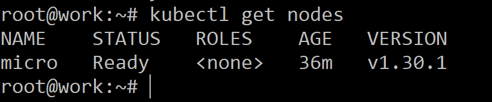

# Домашнее задание к занятию «Kubernetes. Причины появления. Команда kubectl» - Илларионов Дмитрий

### Цель задания

Для экспериментов и валидации ваших решений вам нужно подготовить тестовую среду для работы с Kubernetes. Оптимальное решение — развернуть на рабочей машине или на отдельной виртуальной машине MicroK8S.

------

### Чеклист готовности к домашнему заданию

1. Личный компьютер с ОС Linux или MacOS 

или

2. ВМ c ОС Linux в облаке либо ВМ на локальной машине для установки MicroK8S  

------

### Инструкция к заданию

1. Установка MicroK8S:
    - sudo apt update ,
    - sudo apt install snapd,
    - sudo snap install microk8s --classic,
    - добавить локального пользователя в группу `sudo usermod -a -G microk8s $USER`,
    - изменить права на папку с конфигурацией `sudo chown -f -R $USER ~/.kube`.

2. Полезные команды:
    - проверить статус `microk8s status --wait-ready`;
    - подключиться к microK8s и получить информацию можно через команду `microk8s command`, например, `microk8s kubectl get nodes`;
    - включить addon можно через команду `microk8s enable`; 
    - список addon `microk8s status`;
    - вывод конфигурации `microk8s config`;
    - проброс порта для подключения локально `microk8s kubectl port-forward -n kube-system service/kubernetes-dashboard 10443:443`.

3. Настройка внешнего подключения:
    - отредактировать файл /var/snap/microk8s/current/certs/csr.conf.template
    ```shell
    # [ alt_names ]
    # Add
    # IP.4 = 123.45.67.89
    ```
    - обновить сертификаты `sudo microk8s refresh-certs --cert front-proxy-client.crt`.

4. Установка kubectl:
    - curl -LO https://storage.googleapis.com/kubernetes-release/release/`curl -s https://storage.googleapis.com/kubernetes-release/release/stable.txt`/bin/linux/amd64/kubectl;
    - chmod +x ./kubectl;
    - sudo mv ./kubectl /usr/local/bin/kubectl;
    - настройка автодополнения в текущую сессию `bash source <(kubectl completion bash)`;
    - добавление автодополнения в командную оболочку bash `echo "source <(kubectl completion bash)" >> ~/.bashrc`.

------

### Инструменты и дополнительные материалы, которые пригодятся для выполнения задания

1. [Инструкция](https://microk8s.io/docs/getting-started) по установке MicroK8S.
2. [Инструкция](https://kubernetes.io/ru/docs/reference/kubectl/cheatsheet/#bash) по установке автодополнения **kubectl**.
3. [Шпаргалка](https://kubernetes.io/ru/docs/reference/kubectl/cheatsheet/) по **kubectl**.

------

### Задание 1. Установка MicroK8S

1. Установить MicroK8S на локальную машину или на удалённую виртуальную машину.

установил (код терраформа):

```
            "apt update",
            "apt install snapd",
            "snap install microk8s --classic",
            "mkdir -p ~/.kube",
            "chmod 0700 ~/.kube",
            "microk8s status --wait-ready",
            "usermod -aG microk8s $USER",
            "chown -f -R $USER ~/.kube",
```


2. Установить dashboard.


```
microk8s enable dashboard
```


Потом согласно https://microk8s.io/docs/addon-dashboard#on-linux

```
microk8s kubectl create token default
```


Еще выполнил:

```
nano /var/snap/microk8s/current/certs/csr.conf.template
```

ДОбавил внешние IP:

```
[ alt_names ]
DNS.1 = kubernetes
DNS.2 = kubernetes.default
DNS.3 = kubernetes.default.svc
DNS.4 = kubernetes.default.svc.cluster
DNS.5 = kubernetes.default.svc.cluster.local
IP.1 = 127.0.0.1
IP.2 = 10.152.183.1
IP.3 = 89.169.133.102
IP.4 = 89.169.130.100
```


-Что бы дашборд потом можно было открыть через внешний IP через браузер со стороннего ПК.

После чего перевыпустил сертификаты:

```
microk8s refresh-certs --cert front-proxy-client.crt
```

С первого раза не заработало:


Попробовал еще раз:

```
microk8s refresh-certs --cert front-proxy-client.crt
```


Получилось.

Далее настроил порт форвардинг с любых IP:

```
 microk8s kubectl port-forward -n kube-system service/kubernetes-dashboard 10443:443 --address='0.0.0.0'
```
Важно - оставил терминал открытым и продолжил в другом, т.е. не нажимать cntl-c не завершать процес форвардинга.


Далее в новом терминале продолжил:

Попробовал локально получить доступ к дашборду:

```
curl --insecure https://127.0.0.1:10443
```


- что-то открывается, доступ по порту есть.

Далее попробовал с локальной ВМ но через внешний IP:

```
curl --insecure https://89.169.133.102:10443
```


Тоже что-то открывается.

Далее попробую через браузер с ПК, но, для этого сначала токен получаю:

```
 microk8s kubectl create token default
```


Далее зашел через браузер с ПК и вставил токен и получил доступ к дашборду:


Был вопрос - почему пишет что проброс на 8443 а не на 443 как было указано в команде?
Потому что 443 порт не доступен по умолчанию, и поэтому дашборд делается на 8443 и проброс на этот же порт.

При попытке подключиться через curl:


3. Сгенерировать сертификат для подключения к внешнему ip-адресу.

Уже выполнил сразу ранее - см. выше.

Еще раз тут:

Открыл:

 ```
 nano /var/snap/microk8s/current/certs/csr.conf.template
 ```

Там дописал 3 IP = внешнему IP:

```
[ alt_names ]
DNS.1 = kubernetes
DNS.2 = kubernetes.default
DNS.3 = kubernetes.default.svc
DNS.4 = kubernetes.default.svc.cluster
DNS.5 = kubernetes.default.svc.cluster.local
IP.1 = 127.0.0.1
IP.2 = 10.152.183.1
IP.3 = 89.169.133.102
```


Выполнил:

```
microk8s refresh-certs --cert front-proxy-client.crt
```

Но, если выполнить:

```
microk8s config
```

То, получаем опять тольк внутренний IP

```
    server: https://192.168.10.11:16443
  name: microk8s-cluster
```

Но, это нормально, т.к. дашборд через внешний IP через https заработал.

------

### Задание 2. Установка и настройка локального kubectl
1. Установить на локальную машину kubectl.

Установил на другую ВМ в облаке.

Код из террформ:

```
            "curl -LO https://storage.googleapis.com/kubernetes-release/release/`curl -s https://storage.googleapis.com/kubernetes-release/release/stable.txt`/bin/linux/amd64/kubectl;",
            "chmod +x ./kubectl",
            "mv ./kubectl /usr/local/bin/kubectl",
```
Далее скопировал конфиг, полученный:

```
microk8s config
```

В файл kube_test на другой ВМ.

Настроил на другой ВМ 2:

```
 export KUBECONFIG=kube_test
```
При этом в конфиге указан внутренний IP и т.к. ВМ 2 "work" в той же подсети что и ВМ1 "micro" то идет подключение:

```
kubectl get nodes
```


Попробовал в файле конфига прописать внешний IP


Остальное оставил без изменения.

Выполнил:

```
export KUBECONFIG=kube_test2
```

Посмотрел конфиг командой:

```
kubectl config view
apiVersion: v1
clusters:
- cluster:
    certificate-authority-data: DATA+OMITTED
    server: https://89.169.133.102:16443
  name: microk8s-cluster
contexts:
- context:
    cluster: microk8s-cluster
    user: admin
  name: microk8s
current-context: microk8s
kind: Config
preferences: {}
users:
- name: admin
  user:
    client-certificate-data: DATA+OMITTED
    client-key-data: DATA+OMITTED

```


Подключение работает:



Еще пробовал:


2. Настроить локально подключение к кластеру.

Подключение получилось - см. выше.

3. Подключиться к дашборду с помощью port-forward.

Ранее уже при настройке внешних IP добавил внешний IP второй ВМ в файл конфига, и ранее выпустил сертификаты - см. выше где настраивал дашборд.

Настраиваю проброс портов:

```
kubectl port-forward -n kube-system service/kubernetes-dashboard 10443:443 --address='0.0.0.0'
```


Далее подключаюсь через внешний IP второй ВМ из браузера с домашнего ПК.


ввожу токен и вхожу в дашборд:


Не уверен, нормально ли что нечего отображать.
Отображать есть например в:


------

### Правила приёма работы

1. Домашняя работа оформляется в своём Git-репозитории в файле README.md. Выполненное домашнее задание пришлите ссылкой на .md-файл в вашем репозитории.
2. Файл README.md должен содержать скриншоты вывода команд `kubectl get nodes` и скриншот дашборда.

------

### Критерии оценки
Зачёт — выполнены все задания, ответы даны в развернутой форме, приложены соответствующие скриншоты и файлы проекта, в выполненных заданиях нет противоречий и нарушения логики.

На доработку — задание выполнено частично или не выполнено, в логике выполнения заданий есть противоречия, существенные недостатки.

---

Черновик

1  apt update
    2  apt install  snapd
    5  snap install microk8s --classic
    6  usermod -aG microk8s $USER
    7  chown -f -R $USER ~/.kube
    8  microk8s status --wait-ready
    9  microk8s command
   10  microk8s status
   11  microk8s config
   12  nano /var/snap/microk8s/current/certs/csr.conf.template
   13  microk8s refresh-certs --cert front-proxy-client.crt


   14  curl -LO https://storage.googleapis.com/kubernetes-release/release/`curl -s https://storage.googleapis.com/kubernetes-release/release/stable.txt`/bin/linux/amd64/kubectl;
   15  chmod +x ./kubectl;
   16  mv ./kubectl /usr/local/bin/kubectl
